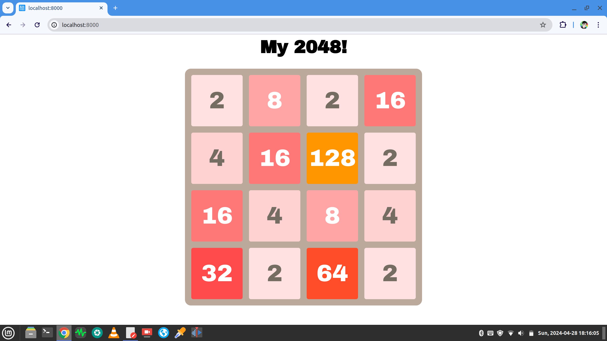

# 2048 GAME

This program is a 2048 mini game developed in JavaScript.

I learned this project from [this blogger’s Youtube video](https://www.youtube.com/watch?v=E7dPuq74zNI&list=PLSo-C2L8kdSMKSSRa3FKkEijeghC_r22w).

[](https://www.youtube.com/watch?v=E7dPuq74zNI&list=PLSo-C2L8kdSMKSSRa3FKkEijeghC_r22w "JavaScript Courses")

## Usage

1. Clone the repo.

    ```shell
    git clone https://github.com/junsircoding/js_game_2048.git
    ```

2. Start a simple server with Python 3.

    ```shell
    python -m http.server
    ```

3. Open a browser and access `localhost:8000` .

Enjoy it!



4. Play games with AI

Open the Chrome browser's `inspect` interface (F12)

```javascript
agent = new GameAgent(game_model);
agent.play(100);
```

## Feature list to be completed

- [x] Basic function development and color matching.
- [x] When the grid fusions, display the movement trajectory.
- [ ] When the grid with the content "2048" appears, display the "You Win" message.
- [ ] When all grids are occupied and no further fusion can be generated, display the "Game Over" message.
- [x] Added score recording function.
- [ ] Automatically generate blended block colors instead of manually specifying them in each case.
- [x] Add artificial intelligence automatic play function.
